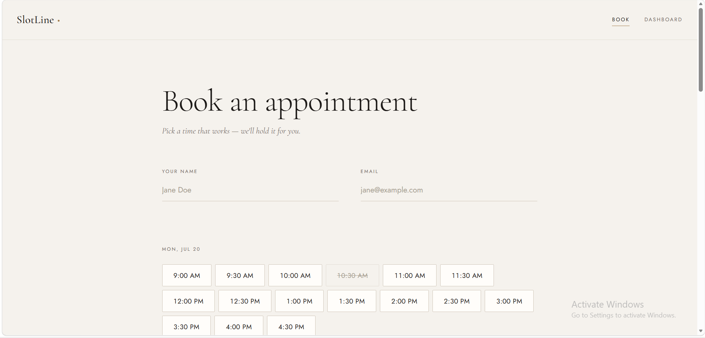
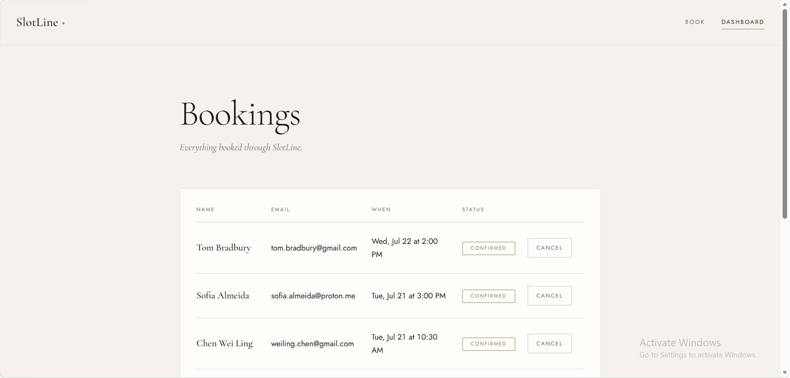

# SlotLine

A full-stack appointment booking app. Visitors pick an open time slot and book it; the
owner sees every booking on a dashboard and can cancel one.

**Live demo:** https://slotline.vercel.app/
**API:** https://slotline-api.onrender.com/api/health

> The demo is deployed on free-tier hosting. Demo data is reset periodically.




---

## Features

- Public booking page showing available 30-minute slots for the next 7 days
- Slot availability computed live from existing bookings — booked times are disabled
- Server-side validation: bookings are re-checked against the database before saving,
  so two people can't take the same slot
- Owner dashboard listing all bookings, newest first
- Cancellation via soft delete — the record is kept and the slot reopens
- Responsive layout; the dashboard table reflows into stacked cards on mobile
- Accessible form labels, 44px touch targets, visible focus states

## Tech stack

| Layer | Technology |
|---|---|
| Frontend | React 19, TypeScript, Vite, React Router |
| Backend | Node.js, Express 5, TypeScript |
| Database | PostgreSQL (Neon) via Prisma |
| Hosting | Vercel (frontend), Render (API), Neon (database) |

## Architecture

```
Browser (React)  →  Express API  →  PostgreSQL
     ↑___________________|_______________|
              JSON responses
```

The frontend never talks to the database directly. All validation and availability
checks happen server-side, since anything running in the browser can be bypassed.

Available slots are **computed**, not stored: the server generates every possible slot
from a fixed rule (09:00–17:00, 30-minute intervals, 7 days) and marks a slot unavailable
if a confirmed booking exists at that exact time. This keeps the schema to a single table.

## Running locally

**Prerequisites:** Node.js 18+, a PostgreSQL database (a free [Neon](https://neon.tech)
project works).

```bash
git clone https://github.com/chengyin-dev/slotline.git
cd slotline
```

**Backend**

```bash
cd server
npm install
# create server/.env:
#   DATABASE_URL="postgresql://..."
#   PORT=4000
npx prisma migrate dev
npm run seed      # optional: load demo bookings
npm run dev       # http://localhost:4000
```

**Frontend**

```bash
cd client
npm install
# create client/.env:
#   VITE_API_URL=http://localhost:4000
npm run dev       # http://localhost:5173
```

## API

| Method | Endpoint | Description |
|---|---|---|
| `GET` | `/api/slots` | All slots for the next 7 days, each marked available or taken |
| `POST` | `/api/bookings` | Create a booking (`{ name, email, startTime }`). Returns `409` if the slot was taken |
| `GET` | `/api/bookings` | All bookings, newest first |
| `PATCH` | `/api/bookings/:id/cancel` | Cancel a booking; the slot becomes available again |

## Scope and roadmap

v1 deliberately ships the core booking loop end to end rather than a partial feature set.
The dashboard is intentionally unauthenticated so the demo is explorable without a login.

Planned:

- [ ] Authentication on the dashboard (via a managed provider — Clerk or Supabase Auth)
- [ ] Email confirmations and reminders
- [ ] Owner-configurable availability (custom hours, days off, multiple services or staff)
- [ ] Time zone support for visitors in other regions
- [ ] Payments / deposits at time of booking

## Design notes

- **Soft deletes** — cancelling sets `status: "cancelled"` rather than removing the row,
  preserving history while freeing the slot.
- **UTC throughout** — slots are generated, stored, and displayed in UTC to avoid
  timezone drift between the browser, server, and database. Per-visitor localization is
  on the roadmap rather than half-implemented.
- **Auth deferred, not forgotten** — authentication is planned via a managed provider
  rather than hand-rolled.

## License

MIT — see [LICENSE](LICENSE).